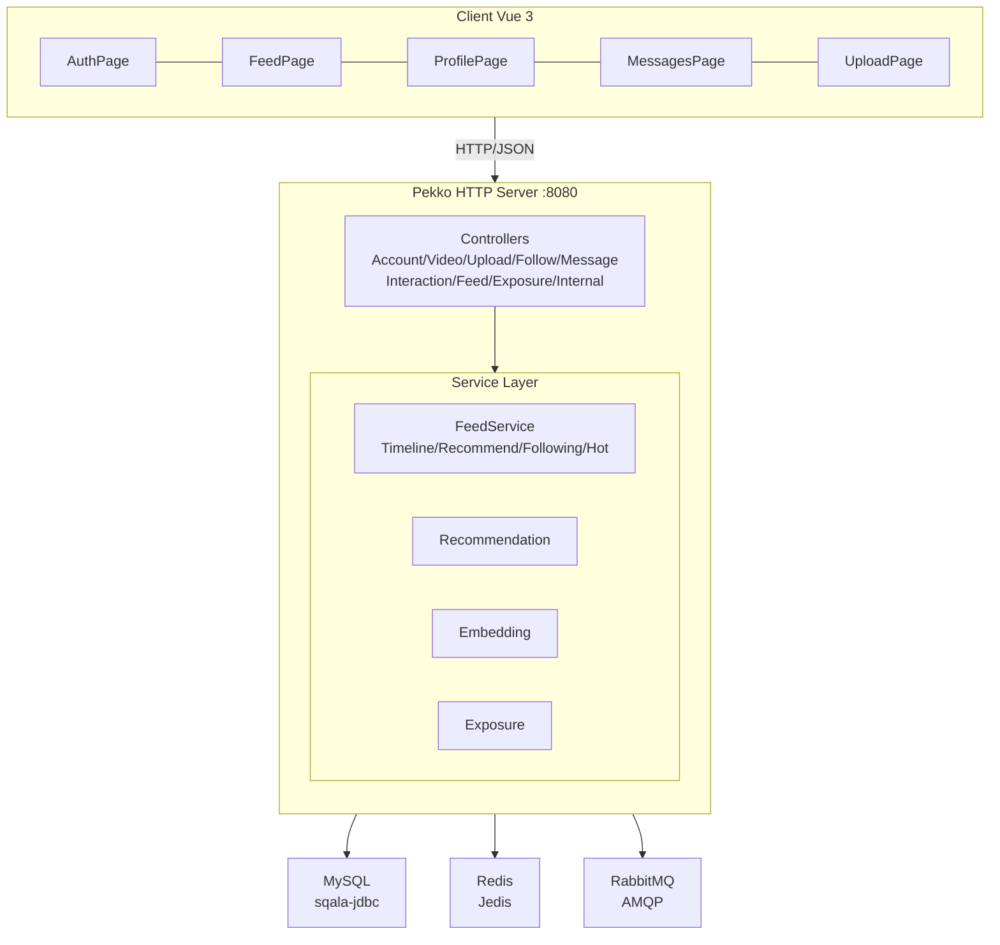
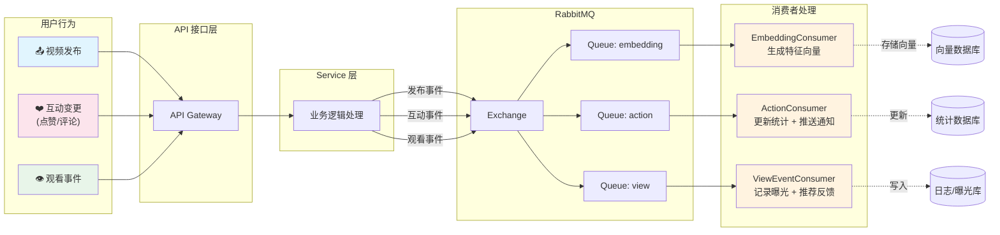

# PigFeed 🐷

[](https://scala-lang.org/)
[](https://vuejs.org/)
[](https://pekko.apache.org/)
[](LICENSE)

**PigFeed** 是一个基于 Scala 3 + Vue 3 的短视频 Feed 推荐平台，实现了多场景 Feed 流（时间线、推荐、关注、热榜）、社交互动（点赞/收藏/评论）、关系链（关注/粉丝）、消息通知、曝光追踪与推荐排序等核心功能。

---

## ✨ 特性

- 🏗️ **多策略 Feed 引擎** — 基于策略模式实现四种 Feed 场景：`Timeline`（时间线）、`Recommend`（推荐）、`Following`（关注）、`Hot`（热榜），支持游标分页与 Redis 缓存
- 🎯 **推荐流水线** — 视频特征向量（Embedding）生成、候选召回、排序打分、打散曝光一条龙
- 📡 **事件驱动架构** — 基于 RabbitMQ 的异步消息处理：视频发布 → Embedding 计算、互动变更 → 通知推送、观看事件 → 曝光记录
- 🔐 **JWT 认证** — 基于 JWT 的无状态认证，支持注册、登录、登出
- 💬 **社交互动** — 点赞、收藏、评论、关注/粉丝关系链
- 🔔 **消息通知** — 站内消息系统，支持未读计数、批量已读
- 📤 **文件上传** — 支持图片/视频上传，集成 FFprobe 获取媒体元信息
- 🗄️ **数据库迁移** — Flyway 自动管理 MySQL Schema
- ⚡ **高性能缓存** — Redis 缓存 Feed 页、视频卡片、统计数据，配合 SingleFlight 防止缓存穿透

---

## 🛠️ 技术栈

### 后端

| 类别        | 技术                    | 版本         |
| ----------- | ----------------------- | ------------ |
| 语言        | Scala                   | 3.8.4        |
| HTTP 框架   | Pekko HTTP + Tapir      | 1.13.23      |
| JSON 序列化 | Circe                   | (Tapir 集成) |
| 函数式编程  | Kyo                     | 1.0.0-RC4    |
| 数据库      | MySQL                   | 8.0+         |
| JDBC 连接池 | HikariCP                | 7.1.0        |
| ORM         | sqala-jdbc              | 0.7.5        |
| 数据库迁移  | Flyway                  | 12.9.0       |
| 缓存        | Redis (Jedis)           | 7.5.2        |
| 消息队列    | RabbitMQ (AMQP)         | 5.32.0       |
| 认证        | JWT (jwt-scala)         | 11.0.4       |
| 密码加密    | jBCrypt                 | 0.4          |
| 日志        | Logback + Scala Logging | 1.5.34       |

### 前端

| 类别        | 技术       | 版本 |
| ----------- | ---------- | ---- |
| 框架        | Vue.js     | 3.5  |
| 构建工具    | Vite       | 5.4  |
| 状态管理    | Pinia      | 2.2  |
| 路由        | Vue Router | 4.4  |
| HTTP 客户端 | Axios      | 1.7  |

---

## 🏛️ 架构概览



### 🔄 异步事件流



### 📊 Feed 策略模式

四种 Feed 场景通过统一的 `Strategy` 接口分发：

| 场景        | 策略                | 数据源                   | 排序方式                                |
| ----------- | ------------------- | ------------------------ | --------------------------------------- |
| `timeline`  | `TimelineStrategy`  | 全局收件箱               | 发布时间倒序                            |
| `recommend` | `RecommendStrategy` | 推荐服务                 | 综合得分（热度+相似度+新鲜度+观看时长） |
| `following` | `FollowingStrategy` | 关注作者收件箱           | 发布时间倒序（用户维度缓存）            |
| `hot`       | `HotStrategy`       | Redis 热度窗口 + DB 降级 | 互动热度加权                            |

---

## 📁 项目结构

```
feed-scala/
├── build.sbt                          # SBT 构建配置
├── build.mill                         # Mill 构建配置
├── mill-build/
│   └── src/Deps.scala                 # Mill 依赖定义
├── project/
│   ├── build.properties
│   └── plugins.sbt
├── src/
│   ├── main/
│   │   ├── resources/
│   │   │   ├── db/migration/          # Flyway SQL 迁移脚本
│   │   │   │   ├── V1__init.sql       # 初始化 Schema
│   │   │   │   └── V2__video_index.sql
│   │   │   ├── application.conf       # 主配置（激活环境选择）
│   │   │   ├── application-dev.conf   # 开发环境配置（未上传）
│   │   │   ├── application-prod.conf  # 生产环境配置
│   │   │   └── logback.xml            # 日志配置
│   │   └── scala/
│   │       ├── Application.scala      # 应用入口
│   │       ├── utils/                 # 通用工具层
│   │       │   ├── base/              # 基础工具（配置、日志、ID生成、JSON、HTTP）
│   │       │   ├── db/                # 数据库工具
│   │       │   ├── redis/             # Redis 工厂与操作封装
│   │       │   ├── result/            # 统一响应结构 R[T]
│   │       │   ├── route/             # HTTP 路由基础设施
│   │       │   ├── thread/            # 虚拟线程任务
│   │       │   └── time/              # 时间工具
│   │       └── internal/              # 业务模块
│   │           ├── InitService.scala  # 启动引导
│   │           ├── auth/              # 账户模块（注册/登录/用户信息）
│   │           ├── video/             # 视频模块（CRUD）
│   │           ├── upload/            # 上传模块（文件上传 + FFprobe）
│   │           ├── relation/         # 关系模块（关注/粉丝）
│   │           ├── message/          # 消息模块（通知/未读）
│   │           ├── interaction/      # 互动模块（点赞/收藏/评论）
│   │           ├── feed/             # Feed 模块（多策略 Feed 流）
│   │           ├── exposure/         # 曝光模块（观看事件/推荐候选/曝光决策）
│   │           └── infra/            # 基础设施（MQ/错误码/路由）
│   └── test/  
│       └── scala/                     # 测试代码（未上传）
│           ├── common/                # 通用测试
│           └── http/                  # HTTP API 集成测试
├── src/web/                          # Vue 3 前端
│   ├── index.html
│   ├── package.json
│   ├── vite.config.js
│   ├── nginx.conf                     # Nginx 部署配置
│   └── src/
│       ├── main.js                    # 应用入口
│       ├── App.vue                    # 根组件
│       ├── router/                    # 路由配置
│       ├── stores/                    # Pinia 状态管理
│       ├── utils/                     # 工具函数
│       ├── api/                       # API 调用封装
│       └── views/                     # 页面组件
│           ├── AuthPage.vue           # 登录/注册页
│           ├── FeedPage.vue           # Feed 流页
│           ├── ProfilePage.vue        # 用户主页
│           ├── MessagesPage.vue      # 消息页
│           └── UploadPage.vue        # 上传页
├── uploads/                           # 文件上传存储目录
├── API.md                             # API 接口文档
└── README.md
```

---

## 🚀 快速开始

### 环境要求

| 依赖     | 版本要求                       |
| -------- | ------------------------------ |
| JDK      | 21+                            |
| Scala    | 3.8.4（build.sbt 已指定）      |
| Node.js  | 18+                            |
| MySQL    | 8.0+                           |
| Redis    | 6.0+                           |
| RabbitMQ | 3.12+                          |
| FFmpeg   | 7+（上传视频时用于元信息探测） |

### 1. 克隆项目

```bash
git clone https://github.com/your-username/feed-scala.git
cd feed-scala
```

### 2. 后端配置

编辑 `src/main/resources/application-dev.conf`，根据本地环境修改以下配置：

```hocon
# MySQL 数据库连接
hikari {
  jdbcUrl = "jdbc:mysql://127.0.0.1:3306/feed?useSSL=false&serverTimezone=Asia/Shanghai&characterEncoding=utf8&useUnicode=true"
  username = "root"
  password = "your_password"
  migrateOnStart = true   # 启动时自动执行 Flyway 迁移
}

# Redis 缓存
redis {
  host = "127.0.0.1"
  port = 6379
  password = "your_password" # 需要提供密码
}

# RabbitMQ 消息队列
mq {
  config {
    host = "127.0.0.1"
    port = 5672
    username = "guest"
    password = "guest"
  }
}

# 本地上传目录
upload {
  root = "uploads"
  ffmpeg = "D:\\ffmpeg\\bin\\"   # FFmpeg 路径（Windows 示例）
}
```

### 3. 启动后端服务

**使用 SBT：**

```bash
# 进入项目根目录
cd feed-scala

# 编译并运行
sbt run

# 或者先打包再运行
sbt clean assembly
java -jar target/scala-3.8.4/feed-scala-assembly-0.1.0-SNAPSHOT.jar
```

**使用 Mill：**

```bash
mill run
```

服务启动后访问：`http://localhost:8080`

### 4. 启动前端开发服务器

```bash
cd src/web

# 安装依赖
npm install

# 启动开发服务器
npm run dev
```

前端默认运行在 `http://localhost:5173`，Vite 已配置代理到后端 API。

### 5. 生产环境部署

**后端打包：**

```bash
sbt clean assembly
# 输出：target/scala-3.8.4/feed-scala-assembly-0.1.0-SNAPSHOT.jar
```

**前端打包：**

```bash
cd src/web
npm run build
# 输出：dist/
```

**使用 Nginx 部署前端：**

```nginx
server {
    listen 80;
    server_name your-domain.com;

    # 前端静态资源
    root /path/to/src/web/dist;
    index index.html;

    # API 代理到后端
    location /api/ {
        proxy_pass http://127.0.0.1:8080/;
        proxy_set_header Host $host;
        proxy_set_header X-Real-IP $remote_addr;
    }

    # 静态文件（上传的图片/视频）
    location /uploads/ {
        alias /path/to/feed-scala/uploads/;
    }
}
```

---

## 📖 API 文档

详细的 API 接口文档请参阅 [API.md](API.md)。

覆盖 **9 个控制器**、**33 个 API 端点**，涵盖：

- 🔐 **账户模块** — 注册、登录、登出、用户信息管理
- 🎬 **视频模块** — 视频发布、查询、删除、列表
- 📤 **上传模块** — 文件上传（multipart/form-data）
- 👥 **关系模块** — 关注/取消关注、粉丝/关注列表
- 🔔 **消息模块** — 消息列表、已读标记、未读统计
- 💬 **互动模块** — 点赞、收藏、评论（含游标分页）
- 📺 **Feed 模块** — 多场景 Feed 流查询
- 📊 **曝光模块** — 观看事件上报
- 🔧 **内部接口** — 推荐候选、曝光决策、曝光记录（内部服务调用）

### 通用约定

| 项目     | 说明                               |
| -------- | ---------------------------------- |
| 协议     | HTTP                               |
| 数据格式 | JSON (`application/json`)          |
| 认证方式 | `Authorization: Bearer <JWT>`      |
| 统一响应 | `R[T]` 包装：`{ code, msg, data }` |
| 分页方式 | 游标分页（`cursor` + `limit`）     |

---

## 🏗️ 核心设计

### 策略模式 — Feed 场景分发

四种 Feed 场景通过 `Strategy` 特质统一接口：

```scala
trait Strategy {
  def scene: Scene
  def list(request: FeedRequest): Either[Exception, FeedResult]
}
```

每个策略独立实现数据获取与排序逻辑，`FeedService` 按 `scene` 分发：

```scala
object FeedService {
  def getFeed(request: FeedRequest): Either[Exception, FeedResult] =
    request.strategy.list(request)
}
```

### 缓存分层

| 缓存层级     | 内容                    | TTL              |
| ------------ | ----------------------- | ---------------- |
| 视频卡片缓存 | 视频基本信息 + 作者信息 | 长 TTL           |
| 视频统计缓存 | 点赞数、评论数、收藏数  | 中 TTL           |
| Feed 页缓存  | 完整 Feed 分页结果      | 短 TTL，首页更长 |
| 热榜窗口缓存 | Redis ZSet 按分钟桶聚合 | 实时更新         |

### SingleFlight 防缓存穿透

`FollowingStrategy` 和 `TimelineStrategy` 使用 `SingleFlight` 确保同一时刻同一缓存键只有一次实际数据库查询，其余请求等待结果复用。

### 幂等写入

写操作（创建视频、关注/取消关注、点赞/取消点赞、评论）均支持 `Idempotency-Key` 请求头，防止客户端重试导致的重复写入。
